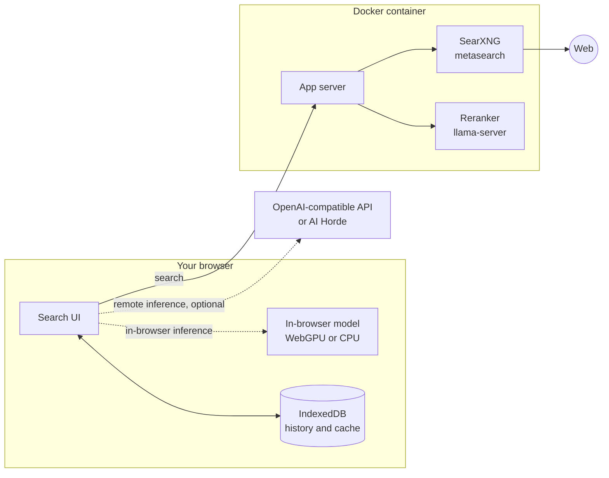

<div align="center">
  <a href="https://felladrin-minisearch.hf.space">
    
  </a>
  <h1>MiniSearch</h1>
  <p><strong>Private AI search that runs in your browser.</strong></p>
  <p>
    <a href="https://felladrin-minisearch.hf.space"></a>
    <a href="https://github.com/felladrin/MiniSearch/actions/workflows/ci.yml"></a>
    <a href="https://github.com/felladrin/MiniSearch/pkgs/container/minisearch"></a>
    <a href="license.txt"></a>
    <a href="https://github.com/felladrin/MiniSearch/stargazers"></a>
  </p>
  
</div>

## About

MiniSearch is a self-hosted search engine with an AI assistant.

The AI can run entirely inside your browser tab, on GPU or CPU, so a working setup needs no API key, no separate inference server, and no third party seeing your queries. Web results come from a bundled [SearXNG](https://github.com/searxng/searxng) metasearch instance, are reranked locally, and the whole thing ships as a single Docker container.

## Features

- **Private by design.** No tracking, no telemetry, no accounts. Search history, cached results, and chats are stored in your browser and never leave your machine.
- **AI in your browser.** Pick from 30+ curated models (135M to 4B parameters) that run on WebGPU where available and on CPU elsewhere. Models are downloaded once and cached by the browser.
- **Any backend you like.** Connect an OpenAI-compatible API (Ollama, LM Studio, vLLM, llama.cpp server, or a hosted provider), use the crowdsourced AI Horde, or let the server proxy your own API without exposing its key.
- **A real search pipeline.** Text and image results aggregated by SearXNG, reranked locally by a cross-encoder model, cached, and rate-limited; all inside the container.
- **Answers you can verify.** Responses cite the sources they draw from, support follow-up questions with conversation memory, reveal the model's reasoning on demand, and can be read aloud.
- **Local history and analytics.** Fuzzy-searchable history with pinning and full-session restore, plus usage statistics and an activity heatmap. Retention is configurable, and storage stays in the browser.
- **Fits your workflow.** Set it as your browser's default search engine, trigger it from Raycast, embed it in your own pages, and optionally protect your instance with access keys.

## Quick start

Run the published image:

```bash
docker run -p 7860:7860 ghcr.io/felladrin/minisearch:main
```

Then open <http://localhost:7860> and start searching.

<details>
<summary>Use Docker Compose</summary>

Add the service to your `docker-compose.yml`:

```yaml
services:
  minisearch:
    image: ghcr.io/felladrin/minisearch:main
    ports:
      - "7860:7860"
```

</details>

<details>
<summary>Build from source</summary>

```bash
git clone https://github.com/felladrin/MiniSearch.git
cd MiniSearch
docker compose -f docker-compose.production.yml up --build
```

</details>

<details>
<summary>Host it on Hugging Face</summary>

[Duplicate the Space](https://huggingface.co/spaces/Felladrin/MiniSearch?duplicate=true) to get your own hosted instance, no server required. Environment variables can be set in the Space settings.

</details>

## How it works



Your query goes to the app server, which asks the bundled SearXNG instance to aggregate results from multiple search engines. The server reranks them with a small cross-encoder model before returning them, and the browser caches them locally. If the AI response is enabled, the assistant reads the top results and writes a cited answer, either with a model running in your browser or through the backend you configured. The full picture is in [docs/overview.md](docs/overview.md).

## Configuration

Set these in a `.env` file (see [.env.example](.env.example)) when using Docker Compose, or pass them with `-e`/`--env-file` to `docker run`:

| Variable | Purpose | Default |
| --- | --- | --- |
| `ACCESS_KEYS` | Comma-separated keys that gate access to the instance | Unset (open access) |
| `ACCESS_KEY_TIMEOUT_HOURS` | How long a validated key stays cached in the browser | `24` |
| `WLLAMA_DEFAULT_MODEL_ID` | Default model for in-browser inference | `qwen-3-0.6b` |
| `DEFAULT_INFERENCE_TYPE` | Backend preselected in the UI: `browser`, `openai`, `horde`, or `internal` | `browser` |
| `INTERNAL_OPENAI_COMPATIBLE_API_BASE_URL` | Base URL of a self-hosted API that the server proxies for its users | Unset (disabled) |
| `INTERNAL_OPENAI_COMPATIBLE_API_KEY` | Key for that API; never sent to clients | Unset |
| `INTERNAL_OPENAI_COMPATIBLE_API_MODEL` | Model served through that API | Auto-detected |
| `INTERNAL_OPENAI_COMPATIBLE_API_NAME` | Name shown for it in the UI | `Internal API` |

The full reference, including server options such as `PORT` and `ALLOWED_HOSTS`, is in [docs/configuration.md](docs/configuration.md).

## FAQ

<details>
<summary>How do I make it my browser's default search engine?</summary>

Add a custom search engine in your browser settings using the pattern `http://localhost:7860/?q=%s`, replacing the host with your instance's address. Your search term replaces `%s`.

</details>

<details>
<summary>How do I search from Raycast?</summary>

Add [this Quicklink](https://ray.so/quicklinks/shared?quicklinks=%7B%22link%22:%22https:%5C/%5C/felladrin-minisearch.hf.space%5C/?q%3D%7BQuery%7D%22,%22name%22:%22MiniSearch%22%7D) to Raycast, and edit it to point to your own instance if you have one.

</details>

<details>
<summary>Can I use my own models through an OpenAI-compatible API?</summary>

Yes. Open the menu, set "AI Processing Location" to `Remote server (API)`, then fill in the base URL, and optionally an API key and a model name. If the model is left blank, it is picked from the ones the API lists.

</details>

<details>
<summary>Can others use my instance with my API key without seeing it?</summary>

Yes. Configure the `INTERNAL_OPENAI_COMPATIBLE_API_*` variables from the [Configuration](#configuration) table and restart the container. A new option with the name you chose appears in the "AI Processing Location" menu, and the key stays on the server.

</details>

## Contributing

Contributions are welcome. To set up a development environment:

```bash
git clone https://github.com/felladrin/MiniSearch.git
cd MiniSearch
docker compose up
```

The development server runs at <http://localhost:7860>. Hot Module Replacement (HMR) is available on <http://localhost:7861>. Before opening a pull request, run the quality gate:

```bash
docker compose exec development-server npm run lint
```

See the [Contributing Guidelines](.github/CONTRIBUTING.md), [Code of Conduct](.github/CODE_OF_CONDUCT.md), and [Security Policy](.github/SECURITY.md). The codebase is documented for humans and AI agents alike: [agents.md](agents.md) is the navigation hub, and [docs/](docs/) covers the architecture in depth.

## Acknowledgments

MiniSearch builds on the work of these projects:

| Project | Role |
| --- | --- |
| [SearXNG](https://github.com/searxng/searxng) | Metasearch engine behind the results |
| [wllama](https://github.com/ngxson/wllama) and [llama.cpp](https://github.com/ggml-org/llama.cpp) | In-browser inference and local reranking |
| [AI Horde](https://aihorde.net) | Crowdsourced distributed inference |
| [AI SDK](https://github.com/vercel/ai) | Client for OpenAI-compatible APIs |
| [Mantine](https://mantine.dev) | UI components |
| [Hugging Face](https://huggingface.co) | Model hosting and the live demo Space |

## License

MiniSearch is released under the [Apache License 2.0](license.txt).
